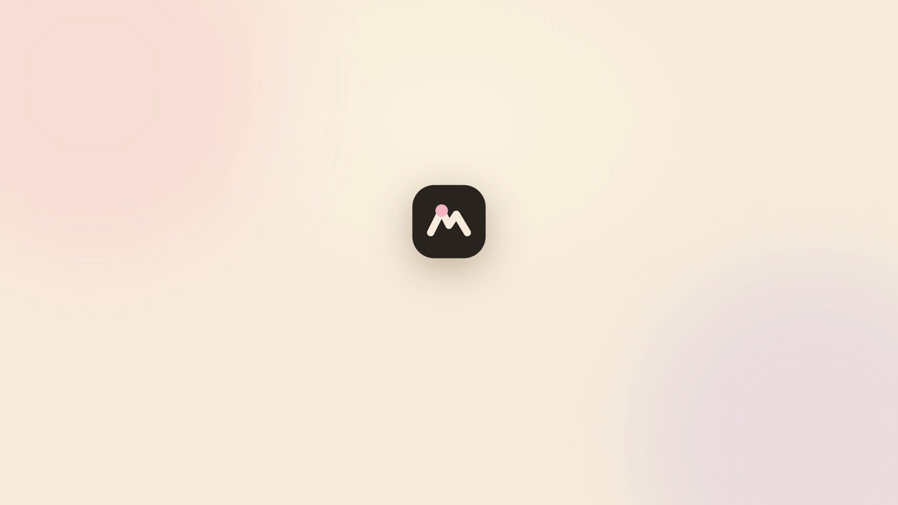
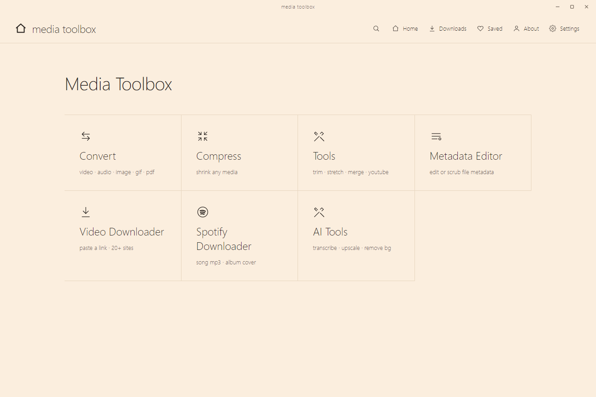

<h1 align="center">media toolbox</h1>

<p align="center">
  Convert, compress, edit and download media, and run on-device AI, entirely on your machine. No upload, no size limit, no account, no ads.
</p>

<p align="center">
  
  
  
  
  
</p>

---

<!-- ============================================================= -->
<!-- DEMO VIDEO                                                     -->
<!-- The poster below links to the site, which plays the promo.    -->
<!-- For inline playback on GitHub, open this file in the web      -->
<!-- editor and drag docs/media/promo.mp4 into this section — that -->
<!-- produces a user-content <video> URL GitHub plays in-page.     -->
<!-- ============================================================= -->

<p align="center">
  <a href="https://nickkk66.github.io/media-toolbox/">
    
  </a>
</p>
<p align="center"><em>▶ Click to watch the promo · or see it on the <a href="https://nickkk66.github.io/media-toolbox/">website</a>.</em></p>

<p align="center">
  
</p>

## What it does

A single desktop app that drives **ffmpeg, ghostscript, qpdf, yt-dlp and 7-zip**
plus on-device AI, so everything runs locally. Drag a file in, get a result out.
Nothing is uploaded, and there is no size cap.

| | |
|---|---|
| **Convert** | video, audio, image, gif, pdf, archive, change format in a click |
| **Compress** | shrink video / image / audio / pdf / gif to a target size or quality |
| **Tools** | trim, crop, stretch, speed, rotate, flip, resize, GIF maker, color picker, privacy blur |
| **PDF** | merge, split, extract / remove pages, rotate, unlock, protect, flatten, crop, organize |
| **Download** | video, audio, thumbnail and transcripts from YouTube and 20+ sites; Spotify track matching |
| **On-device AI** | background removal, image upscaling, transcription (Whisper), text to speech (Piper) |

## Download

Grab the latest build for **Windows, macOS or Linux** from the
[Releases](../../releases/latest) page.

- **Windows** — `media-toolbox-Setup.exe` (installer) or `media-toolbox-Portable.exe`.
  Unsigned, so SmartScreen will ask: choose **More info → Run anyway**.
- **macOS** — `media-toolbox-mac.dmg` (Apple Silicon). Unsigned, so the first launch
  needs a nudge past Gatekeeper (see below).
- **Linux** — `media-toolbox-linux.AppImage` (portable) or `.deb` (installer).

<details>
<summary><b>macOS: "the app is damaged and can't be opened"</b></summary>

That message just means the download is unsigned and macOS quarantined it. The app
is fine. Clear the quarantine flag once, then open it normally:

```bash
xattr -cr "/Applications/Media Toolbox.app"
```

(Or right-click the app → **Open** → **Open** on the first launch.)

</details>

<details>
<summary><b>Development</b></summary>

Vanilla-JS Electron app. No bundler, no framework, no TypeScript.

```bash
git clone https://github.com/Nickkk66/media-toolbox
cd media-toolbox
npm install          # electron + electron-builder (+ onnxruntime-node)
npm start            # run from source
npm test             # bitrate unit tests
npm run dist         # build installer + portable for the host OS -> build/
```

Build outputs (per host OS): `build/media-toolbox-Setup.exe` /
`media-toolbox-Portable.exe` (Windows), `build/media-toolbox-mac.dmg` /
`media-toolbox-mac.zip` (macOS), `build/media-toolbox-linux.AppImage` /
`media-toolbox-linux.deb` (Linux). Pushing a `v*` tag builds all three on CI
and uploads them to the matching Release.

### Layout

```
src/main         app lifecycle, ipc, serial job queue, settings
src/main/media   per-type convert/compress/op modules (video/image/audio/pdf/gif)
src/main/ffmpeg  ffmpeg arg builder, probe, encoders, binary path resolver
src/renderer     index.html, styles.css, app.js, converters.js
src/preload      contextBridge api
assets/          icon.ico, installer.nsh, installer artwork
docs/            landing page (GitHub Pages) + promo video
```

### Native engines

The heavy tools (ffmpeg, ffprobe, yt-dlp, 7-Zip, Ghostscript, qpdf, exiftool,
Real-ESRGAN, Whisper, Piper) are **not bundled**. They download per-OS on first
use from the `engines-v1` GitHub release and cache under `<userData>/engines`,
which keeps every build tiny. The one in-process native dep is `onnxruntime-node`
(asar-unpacked). AI model weights download on demand to `userData/models/`.

### Notes

- Windows installer is per-machine (requests admin / UAC); macOS + Linux are unsigned.
- macOS shows a Gatekeeper prompt / "damaged" message on first run — see the section above.
- First NSIS build can fail on the uninstaller stub (Defender); just re-run.

</details>

## License

[PolyForm Noncommercial 1.0.0](LICENSE) — free to use, modify and share for
**noncommercial** purposes. Selling it, or rewrapping and selling it, is not
allowed. The bundled tools keep their own licenses (FFmpeg LGPL/GPL, Ghostscript
AGPL, qpdf Apache-2.0, yt-dlp Unlicense).
