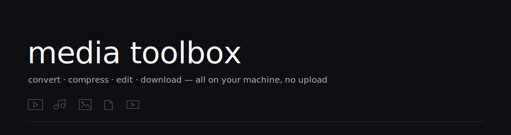

<p align="center">
  
</p>

<h1 align="center">media toolbox</h1>

<p align="center">
  Convert, compress, edit and download media — entirely on your machine. No upload, no size limit, no account.
</p>

<p align="center">
  
  
  
  
  
</p>

---

## What it does

A single desktop app that bundles **ffmpeg, ghostscript, qpdf, yt-dlp and 7-zip**
so everything runs locally — drag a file in, get a result out. Nothing is
uploaded, and there's no 1 GB cap.

| | |
|---|---|
| **Convert** | video · audio · image · gif · pdf — change format in a click |
| **Compress** | shrink video / image / audio / pdf / gif to a target size or quality |
| **Tools** | trim · crop · **stretch** (to TikTok / 16:9) · rotate · flip · resize · GIF maker · color picker |
| **PDF** | merge · split · extract / remove pages · rotate · unlock · protect · flatten · to-image |
| **YouTube** | download video (MP4) · audio (MP3/OGG…) · **transcripts & captions** — 20+ sites |
| **Extras** | unit converter · time-zone converter · archive (zip/7z/tar) converter |

- **Hardware accelerated** — NVIDIA NVENC / Intel QSV / AMD AMF when available.
- **Usage limits** — pick Low / Recommended / Full / Custom so big jobs never max out your PC.
- **Self-contained** — recipients install nothing.

## Private by design

There is no server. Your media is read, processed and written right where it
lives, and the on-device AI models run locally. Cut the network entirely and
every on-device tool keeps working. No ads, no trackers, no account, no
subscription.

## Screenshots

<p align="center">
  
</p>

> The interface follows a [teenage-engineering](https://teenage.engineering)
> inspired design — near-white canvas, hairline type, zero rounded corners, a
> bouncy accordion, and a cursor-driven particle splash on launch.

## Download

Grab the latest **installer** or **portable** build from the
[Releases](../../releases) page. Unsigned, so Windows SmartScreen will ask —
choose **More info → Run anyway**.

## Tech

Electron · vanilla JS renderer · FFmpeg · Ghostscript · qpdf · yt-dlp · 7-Zip.
Built with [`electron-builder`](https://www.electron.build).

<details>
<summary>Build from source</summary>

```bash
npm install
npm start        # run in dev
npm run dist     # build installer + portable to /build
```

Vendor binaries (ffmpeg, ffprobe, yt-dlp, 7za in `vendor/bin`; ghostscript in
`vendor/gs`; qpdf in `vendor/qpdf`) are git-ignored due to size — drop them in
before building.
</details>

## License

MIT — do whatever you like. Bundled tools keep their own licenses
(FFmpeg LGPL/GPL, Ghostscript AGPL, qpdf Apache-2.0, yt-dlp Unlicense).
